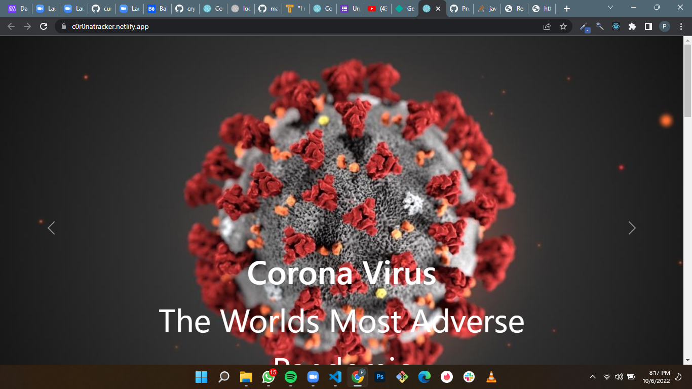
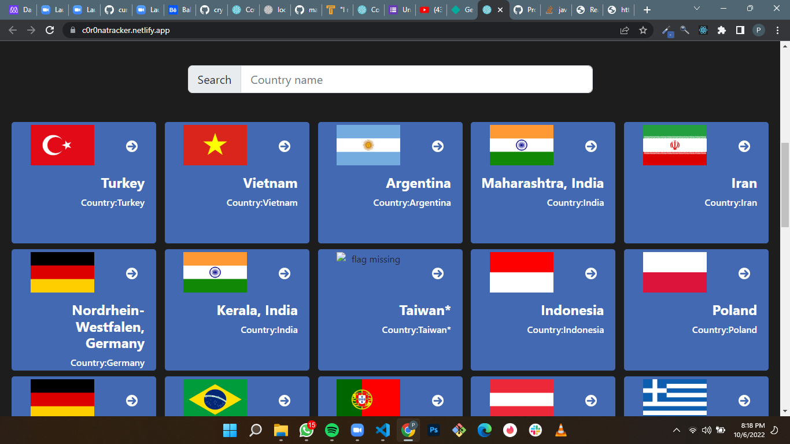
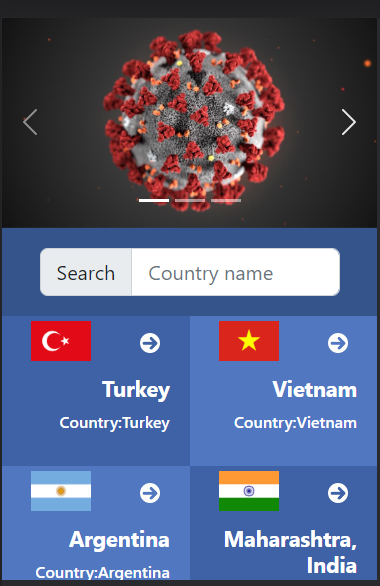
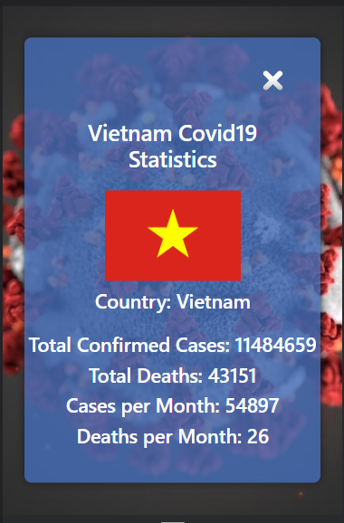

# Covid19 Tracker

> A web app built with Covid-19-API that displays Covid 19 cases, deaths and recovery per country in the entire World

## Built With

- HTML, CSS, JavaScript
- React
- Redux
- WebPack 
- Covid19 API

## Live Demo 

[Live Demo](https://c0r0natracker.netlify.app/)

## Video Demo 

[Video Demo](https://www.loom.com/share/27ba3ebbb2634175b0160631ee638f28)

## ScreenShots
### Desktop screen

### Mobile Screen

## Getting Started

To get a local copy up and running follow these simple example steps.

### Prerequisites

- Install node.js and npm.
- Install Git.

### Setup

- Clone the repository by running the following command in your terminal:
    git clone https://github.com/PromzzyKoncepts/Covid19-Tracker-App.git
    
- Change your directory by by running the following command in your terminal:
    cd space-hub

### Install
- Install the dependencies by running `npm i` in your terminal

### Usage

- After all the dependencies are installed open the app by running npm start in your terminal

### Deployment

## Authors

👤 **PROMISE OKECHUKWU**

- GitHub: [@promzzykoncepts](https://github.com/PromzzyKoncepts)
- Twitter: [@pr0mzzy](https://twitter.com/prOmzzy)
- LinkedIn: [promiseokechukwu](https://linkedin.com/in/promiseokechukwu)

## 🤝 Contributing

Contributions, issues, and feature requests are welcome!

Feel free to check the [issues page](../../issues/).

## Show your support

Give a ⭐️ if you like this project!

## Acknowledgments

- Nelson Sakwa on Behance.
- Covid19 api from John Hopkins University CSSE
- etc

## 📝 License

This project is [MIT](./MIT.md) licensed.
